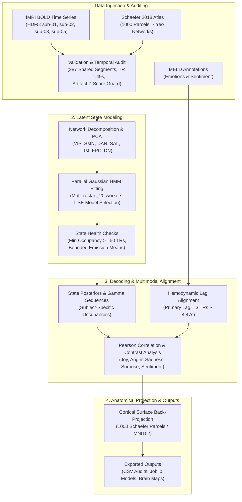

# algonauts-brainstates: Dynamic Brain State & Emotion Modeling

A computational neuroscience toolkit and analysis pipeline for discovering latent cortical network states and decoding emotional dynamics from naturalistic video-watching fMRI data (*Friends* TV series).

Developed for the **Algonauts Project 2025/2026** and **Neuromatch** research challenges.

---

## 1. Project Overview & Scientific Motivation

Naturalistic movie watching evokes rich, continuous reconfigurations of whole-brain functional networks. Rather than treating neural activity as static or driven solely by discrete stimulus onsets, this project investigates how cortical networks transition through discrete **latent dynamic states** and whether these states track depicted emotional arcs in the stimulus.

Key scientific questions addressed in this repository:
1. **Unsupervised Latent Brain State Discovery**: Can recurring cortical network states be discovered directly from continuous BOLD signals using Gaussian Hidden Markov Models (GaussianHMM)?
2. **Shared vs. Network-Specific Dynamics**:
   - *Shared Whole-Brain Dynamics*: Fitting group-level concatenated HMMs across multiple subjects (`sub-01`, `sub-02`, `sub-03`, `sub-05`) to identify subject-invariant brain state transitions.
   - *Network-Specific Dynamics*: Modeling the 7 canonical Yeo functional networks independently via network-level PCA and 4-state Gaussian HMMs with full covariance.
3. **Multimodal Emotion Alignment**: Do latent brain states correspond to naturalistic emotional narratives? We align decoded state posterior probabilities ($\gamma$) with utterance-level emotion and sentiment annotations from the Multimodal EmotionLines Dataset (MELD), accounting for hemodynamic response lag.
4. **Cortical Surface Back-Projection**: How do latent state emission profiles project anatomically across the cortex? We back-project latent state means and emotional condition contrasts onto the 1000-parcel Schaefer 2018 cortical surface atlas.

---

## 2. Pipeline Architecture



---

## 3. Project Structure

```text
Neuromatch-Algonauts2026/
├── pyproject.toml              # Build metadata, dependencies, and pytest configuration
├── uv.lock                     # Deterministic dependency lockfile
├── .gitignore                  # Repository ignore rules (caches, datasets, outputs)
├── src/
│   └── preprocessing/          # Reusable core Python package
│       ├── __init__.py
│       ├── brainstates/        # fMRI data processing, atlas mapping, auditing
│       │   ├── __init__.py
│       │   ├── config.py       # Subjects, Yeo networks, TR, and path settings
│       │   ├── data.py         # H5 segment discovery, parsing, validation
│       │   ├── networks.py     # Schaefer 1000 atlas loader and 7-network parcel mapping
│       │   └── audit.py        # Dataset-wide segment and temporal auditing
│       └── meld/               # MELD emotion dataset integration
│           ├── __init__.py
│           └── meld.py         # MELD download, timestamp parsing, segment alignment
├── notebooks/                  # Interactive research and analysis notebooks
│   ├── get_data_one_episode.ipynb                # Multi-subject shared HMM & 1-SE selection
│   ├── all_subjects_s03e15_network_emotion.ipynb  # Multi-subject S03E15 7-network emotion analysis
│   └── sub01_s01e01_network_emotion.ipynb        # Single-subject S01E01 held-out pilot
├── tests/                      # Automated regression test suite
│   ├── test_hmm_training_parallelism.py          # Validates shared HMM parallel contracts & guards
│   └── test_s03e15_shared_network_hmm.py         # Validates S03E15 analysis helpers & contracts
├── outputs/                    # Generated models, figures, correlation matrices, and audits
│   ├── all_subjects_s03e15_network_emotion/      # S03E15 figures, BOLD maps, correlations
│   ├── sub01_s01e01_network_emotion/             # S01E01 pilot figures, contrast maps
│   ├── hmm_shared_s01e01_clean/                  # Clean shared HMM joblib model and figures
│   ├── data_audit.csv                            # 287-segment dataset audit log
│   └── network_parcels.csv                       # Schaefer 1000 parcel-to-network index table
└── data/                       # Local data storage (ignored by git)
    ├── algonauts_2025.competitors/               # fMRI BOLD HDF5 files per subject
    └── cache/                                    # Nilearn Schaefer atlas and MELD cache
```

---

## 4. Methodological Details

### 4.1 Data Auditing & Segment Discovery
- **fMRI Dataset**: 4 subjects (`sub-01`, `sub-02`, `sub-03`, `sub-05`) watching seasons 1–6 of *Friends*.
- **Temporal Resolution**: $\text{TR} = 1.49\,\text{s}$.
- **H5 Segment Discovery**: Segments follow the naming scheme `ses-XXX_task-sYYeZZ[a|b]`. The pipeline verifies that exactly **287 segments** are shared across all 4 subjects without missing time points or non-finite values.
- **Artifact Rejection**: Includes a global signal artifact guard (`ARTIFACT_Z_THRESHOLD = 20.0`) to filter out scan acquisition anomalies.

### 4.2 Cortical Parcellation & Yeo 7 Networks
The fMRI BOLD signals are registered to the **Schaefer 2018 1000-parcel** surface atlas in MNI152 space. Parcels are mapped into 7 canonical functional networks based on atlas label tokens:
- `VIS` (Visual, `_Vis_`)
- `SMN` (Somatomotor, `_SomMot_`)
- `DAN` (Dorsal Attention, `_DorsAttn_`)
- `SAL` (Salience / Ventral Attention, `_SalVentAttn_`)
- `LIM` (Limbic, `_Limbic_`)
- `FPC` (Frontoparietal Control, `_Cont_`)
- `DN` (Default Mode, `_Default_`)

### 4.3 Gaussian HMM Training & Model Selection
- **Multi-Restart Parallel Fitting**: Multi-start Gaussian HMM optimization parallelized across CPU cores using `joblib` (Loky backend).
- **One Standard Error (1-SE) Rule**: When selecting the number of hidden states $K \in [4, 17]$, the simplest model whose validation log-likelihood is within one standard error of the maximum is selected to prevent overfitting.
- **Model Health Criteria**: Enforces quality criteria to reject degenerate states:
  - Minimum state occupancy $\ge 50$ TRs.
  - Maximum absolute state mean $\le 10.0$ standard deviations.

### 4.4 MELD Emotion Alignment
- **Utterance Timestamps**: Parses MELD dialogue timestamps (`StartTime`, `EndTime`) into seconds and assigns each dialogue to episode splits (`a` vs `b`).
- **Hemodynamic Lag**: Compensates for the Blood Oxygen Level Dependent (BOLD) hemodynamic delay using a default lag of $\text{PRIMARY\_LAG} = 3\,\text{TRs} \approx 4.47\,\text{s}$.
- **Emotion & Sentiment Contrasts**:
  - Discrete emotions: *Joy*, *Anger*, *Sadness*, *Surprise*, *Neutral*.
  - Sentiment contrasts: *Positive minus Negative*.

---

## 5. Notebook Workflows

1. **`notebooks/get_data_one_episode.ipynb` (Shared Concatenated HMM)**:
   - Concatenates multi-subject time series across 7 networks.
   - Evaluates candidate state counts $K \in [4, 17]$ with 20 parallel workers and 1-SE selection.
   - Decodes state posterior probabilities ($\gamma$) and held-out timelines for S01E01.
   - Saves final model to `outputs/hmm_shared_s01e01_clean/shared_hmm.joblib`.

2. **`notebooks/all_subjects_s03e15_network_emotion.ipynb` (Multi-Subject S03E15 Emotion Analysis)**:
   - Performs PCA (10 components) per functional network.
   - Trains 4-state Gaussian HMMs per network with full covariance.
   - Computes Pearson correlations between state posteriors and MELD emotion categories.
   - Back-projects state-specific BOLD activation patterns to all 1000 cortical parcels.

3. **`notebooks/sub01_s01e01_network_emotion.ipynb` (Single-Subject Pilot)**:
   - Single-subject held-out pilot workflow.
   - Computes direct BOLD vs. HMM-implied cortical contrast maps for valence and arousal.

---

## 6. Installation & Quick Start

### Prerequisites
- Python >= 3.11
- Package manager: [`uv`](https://github.com/astral-sh/uv) (recommended) or `pip`

### Installation with `uv`

```bash
# Clone the repository
git clone https://github.com/HeigatVu/algonaut2025-neuromatch.git
cd algonaut2025-neuromatch

# Create virtual environment and install dependencies
uv sync --extra test
```

### Installation with `pip`

```bash
python3 -m venv .venv
source .venv/bin/activate
pip install -e ".[test]"
```

---

## 7. Running Tests

The test suite validates pipeline contracts, parallel fitting logic, model selection criteria, and notebook execution contracts:

```bash
# Using uv
uv run --with pytest python -m pytest

# Using standard virtual environment
pytest
```

---

## 8. Data Configuration

The project expects fMRI BOLD data formatted in HDF5 (`.h5`) under `data/algonauts_2025.competitors/fmri/`:

```text
data/algonauts_2025.competitors/fmri/
├── sub-01/func/sub-01_task-friends_space-MNI152NLin2009cAsym_atlas-Schaefer18_parcel-1000Par7Net_desc-s123456_bold.h5
├── sub-02/func/sub-02_task-friends_space-MNI152NLin2009cAsym_atlas-Schaefer18_parcel-1000Par7Net_desc-s123456_bold.h5
├── sub-03/func/sub-03_task-friends_space-MNI152NLin2009cAsym_atlas-Schaefer18_parcel-1000Par7Net_desc-s123456_bold.h5
└── sub-05/func/sub-05_task-friends_space-MNI152NLin2009cAsym_atlas-Schaefer18_parcel-1000Par7Net_desc-s123456_bold.h5
```

MELD annotations are automatically retrieved from GitHub and cached in `data/cache/` upon running `load_meld()`.

---

## 9. License

This project is licensed under the terms of the project repository.
